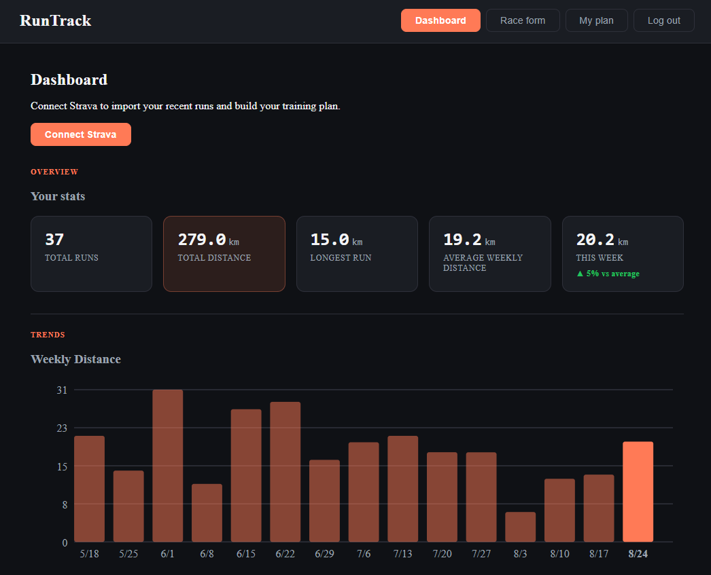
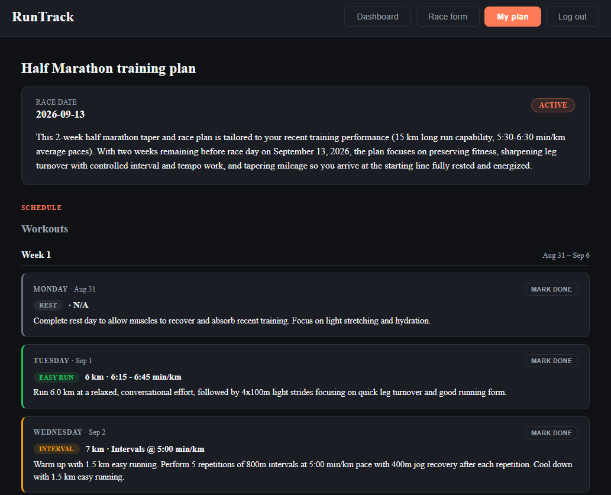

# RunTrack

Runtrack is a full-stack application that connects to Strava, tracks running statistics, and generates AI-powered training plans for upcoming races.





## Tech stack

**Backend**
 - Java 21, Spring Boot
 - Spring Security + JWT (for authentication)
 - Spring Data JPA + PostgreSQL
 - Strava API (activity sync)
 - Google Gemini API (training plan generation)
 - Maven

**Frontend**
- React (Vite)

## API

The backend provides REST endpoints for:
- User registration and login
- Strava connection and activity synchronization
- Running activities
- Running statistics
- AI training plan generation
- Training plans and workouts

## Getting started

### Prerequisites

- Docker and Docker compose
- A Strava API application
- A Google Gemini API key

### Clone the repository

```bash
git clone https://github.com/RokasTverijonas/runtrack.git
cd runtrack
```
### Environment variables

Create a `.env` file in the project root with these variables:

- DB_USERNAME
- DB_PASSWORD
- JWT_SECRET
- JWT_EXPIRATION
- STRAVA_CLIENT_ID
- STRAVA_CLIENT_SECRET
- STRAVA_REDIRECT_URI
- FRONTEND_URL
- GEMINI_API_KEY

### Run with Docker Compose

```bash
docker compose up --build
```

Once running, open ``http://localhost:5173`` in your browser.
